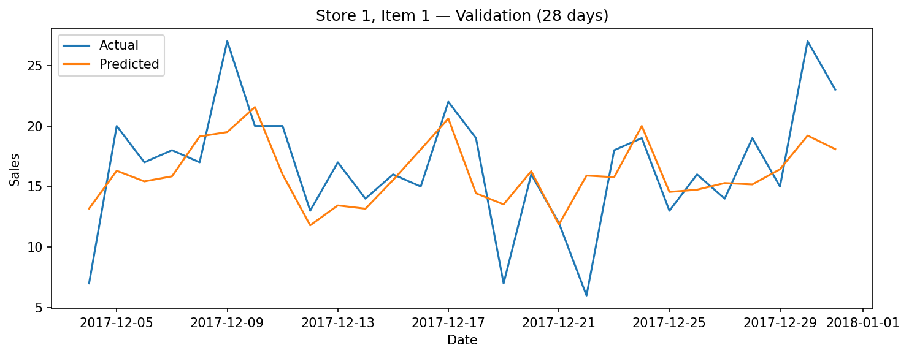
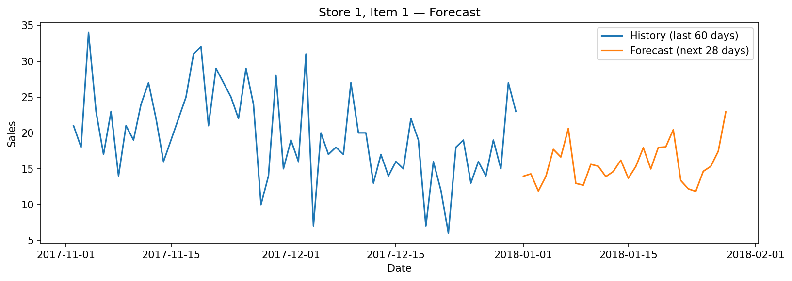

# 🛒 Retail Sales Forecasting (Time Series)

Forecasting daily item-level sales for a retail chain using **feature-engineered gradient-boosted trees (XGBoost)**.  
This project demonstrates **time series modeling**, **feature engineering**, and **interactive visualization** for **real-world demand planning** scenarios.

---

## 📌 Project Overview

Retailers rely on accurate sales forecasts to manage **inventory, staffing, and promotions**.  
Traditional methods (e.g., moving averages) struggle with:
- **Seasonality** (weekly patterns, holidays)
- **Trends** (long-term growth or decline)
- **Multiple stores and products**

This project builds a **machine learning model** to forecast sales **per store, per item**, handling thousands of time series efficiently.  
It showcases:
- **Predictive modeling** for demand forecasting
- **Feature engineering for time series**
- **Validation approach** for temporal data
- A **Streamlit dashboard** for interactive exploration

---

## 🎯 Business Problem

A fictional retail chain wants to:
- Forecast **daily sales** for every `(store, item)` combination
- Plan stock levels, purchasing, and workforce schedules
- Improve accuracy over naive baselines

---

## 🧠 Approach

### **1️⃣ Data**
- Source: Kaggle's *Store Item Demand Forecasting Challenge* (or generated synthetic dataset)  
- Columns:
  - `date` — daily timestamp
  - `store` — store ID
  - `item` — product ID
  - `sales` — units sold that day

---

### **2️⃣ Feature Engineering**
To help a tree-based model learn time dependencies:
- **Calendar features:** day of week, week number, month, year
- **Lag features:** sales from previous 1, 7, 28 days
- **Rolling statistics:** moving averages & standard deviation over 7 and 28 days

This converts a pure time series into a **supervised ML problem**.

---

### **3️⃣ Modeling**
- **Algorithm:** XGBoost Regressor  
- **Split:** last 28 days as validation (time-aware split)  
- **Metrics:** RMSE, MAPE, sMAPE  

The model predicts sales for the next day given recent history and date features.

---

### **4️⃣ Forecasting**
- **Recursive strategy:** predict day `t+1`, append it to history, predict `t+2`, etc.  
- Generates forecasts for the next **N days** for any `(store, item)`.

---

## 📈 Results

- **Validation period:** last 28 days
- **Example metrics:**  
  - RMSE ≈ 4–6 units/day (varies per series)  
  - MAPE ≈ 8–12%  

Visual comparisons show the model **tracks weekly seasonality well** and handles store/item differences effectively.

**Validation (last 28 days)**  


**Forecast (next N days)**  


---

## 🖥️ Interactive App

A lightweight **Streamlit app** lets users:
- Select a **store and item**
- See recent history and forecast
- View validation performance metrics

Run locally:
```bash
python -m streamlit run app/streamlit_app.py
```

---

## 📂 Repository Structure
```text
retail-sales-forcasting/
├── data/
│   └── store_item_demand.csv
├── notebooks/
│   └── sales_forecast.ipynb
├── src/
│   ├── features.py
│   ├── models.py
│   └── tsutils.py
├── app/
│   └── streamlit_app.py
├── artifacts/
│   ├── validation_plot.png
│   └── forecast_plot.png
├── requirements.txt
└── README.md
```

---

## ▶️ How to Run (Local)

```bash
# 1) Create & activate environment
python -m venv .venv
.\.venv\Scripts\Activate.ps1   # Windows
# source .venv/bin/activate    # macOS/Linux

# 2) Install dependencies
pip install --upgrade pip
pip install -r requirements.txt
pip install jupyter ipykernel

# 3) Register Jupyter kernel (optional)
python -m ipykernel install --user --name retail-env --display-name "Python (retail-env)"

# 4) Run notebook
jupyter notebook notebooks/sales_forecast.ipynb
```

---

## 🔧 Tech Stack
- **Python**, **Pandas**, **NumPy**, **Matplotlib/Seaborn**  
- **XGBoost**, **scikit-learn**  
- **Streamlit** (interactive app)  
- **Jupyter Notebook** (analysis)  

---

## 🚀 Next Steps
- Hyperparameter tuning (Optuna + TimeSeriesSplit CV)  
- Holiday and promotion features  
- Model comparison with SARIMAX and Prophet  
- Prediction intervals (quantile regression)  
- Advanced dashboard with Plotly visualizations

---

## 👤 Author
**Alexus Glass (lexusimni)**  
[GitHub](https://github.com/lexusimni)
[Linkedin](https://www.linkedin.com/in/alexus-glass-248061237/)